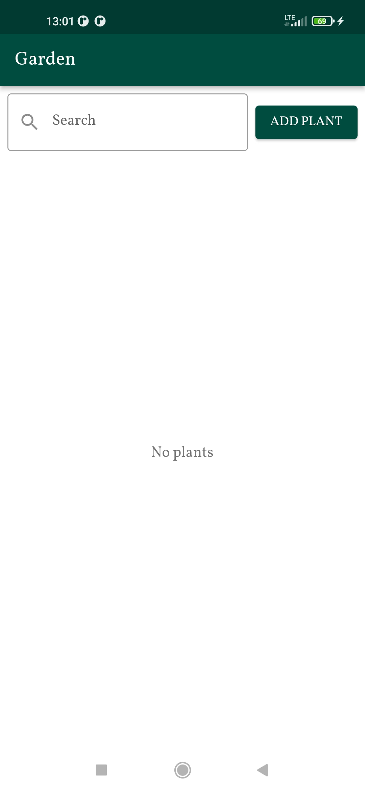
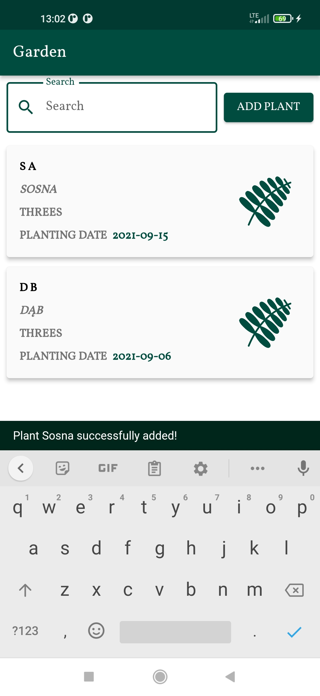
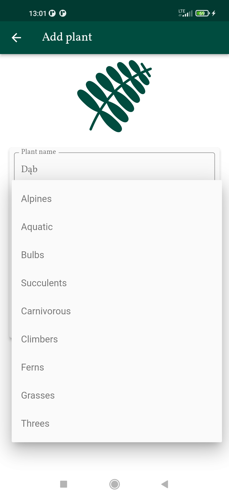

# garden_app

1.Utworzono bazowy projekt, ustawiono motyw aplikacji.
2.Dodano główne foldery(strukturę projektu).
3.Utworzono podstawowe widoki aplikacji.
4.Dodanie helpera dla bazy danych.
5.Dodanie serwisu dodawania roślin do bazy (pobieranie też typów roślin z bazy).
6.Dodanie serwisu aktualizacji rośliny.
7.Dodanie wyszukiwarki i udoskonalenie odświeżania widoków.
8.Dodanie testowej paginacji.
9.Dodanie ikony aplikacji.
9.Poprawki wizualne.
10.Porządkowanie kodu.

